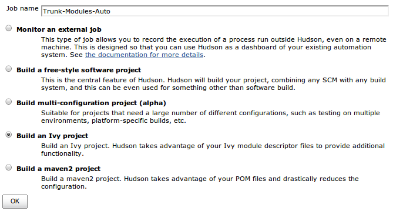
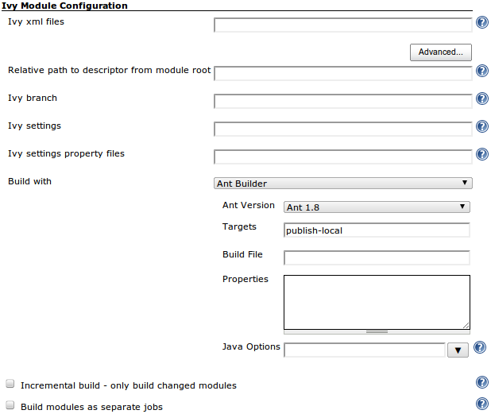
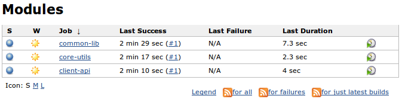
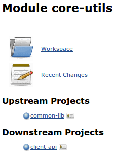
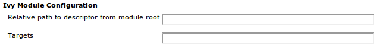
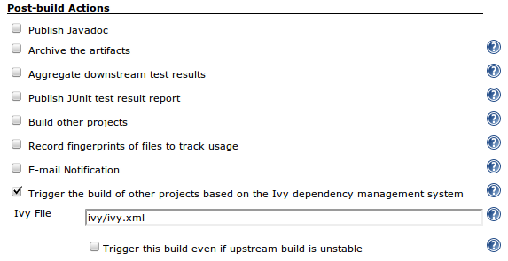
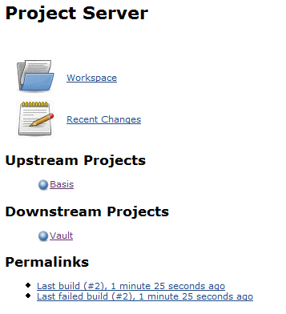

# Ivy Plugin

Provides Jenkins integration with [Apache Ivy](http://ant.apache.org/ivy/).

This plugin automatically configures a build to trigger other builds
based on dependency configuration via [Apache Ivy](http://ant.apache.org/ivy).

## Supported versions

Since Version 2.6 this plugin uses Ivy 2.5.2 internally.

## Creating an Ivy Project (added in version 1.0)

By using an Ivy project instead of a Freestyle project Jenkins can
simplify the job configuration. It will auto-detect all the ivy modules
you checked out, create builds for them, and automatically generate the
upstream/downstream build triggers based on your Ivy dependencies.

1.  Click on the "New Job" link
    
2.  Enter a project name and choose "Build an Ivy project"
    
3.  Fill in your SCM details (you can choose to check out a single ivy
    module, or an entire branch of ivy modules)
4.  Choose the Ant version to build with and enter the targets you want
    run. Most of the options have sensible defaults so you only need to
    fill them in if your modules are set up differently than the default
    values expect. If you want to build each module as a separate job,
    expand the "Advanced" section and check "Build modules as separate
    jobs". If you are polling for changes from your SCM, you can also
    optionally choose to only build changed modules.
    
5.  Now on your Jenkins job page you will see a "Modules" link
    
6.  This will give you a view of all the discovered ivy modules you
    checked out (Note: you will need to build the project once before
    the modules show up)
    
7.  The upstream/downstream project build triggers will be automatically
    generated from the dependencies in your ivy files.
    
8.  If you chose to build the modules as separate jobs, then you can
    click on a module in the module view to see all the individual
    builds, SCM changes, artifacts, etc.
9.  If you want to run different targets on a certain module then you
    can override the default targets in the module configuration.
    

## Build Trigger Configuration (for Freestyle Projects)

Upon building, it scans the ivy.xml and fills in the 'build other
projects' setting, which results in output on the project page of which
projects are upstream (depends on) and which are downstream (is a
dependency).

